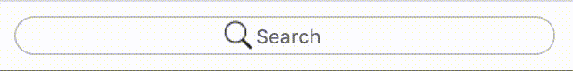

# Pretty Search Bar


## Installation
* add `pretty-search-bar.js` and `pretty-search-bar.css` files to your HTML file
* insert the following HTML template
```
<div class="search-bar" tabIndex='-1'>
 	<div class="search-bar-field">
		<!-- insert your search icon here -->
 		<input class="search-input" type="text" placeholder="Search">
	</div>
 	<button class="search-bar-clear" type="button">
	<!--- insert your close button icon here -->
 	</button>
</div>
```
